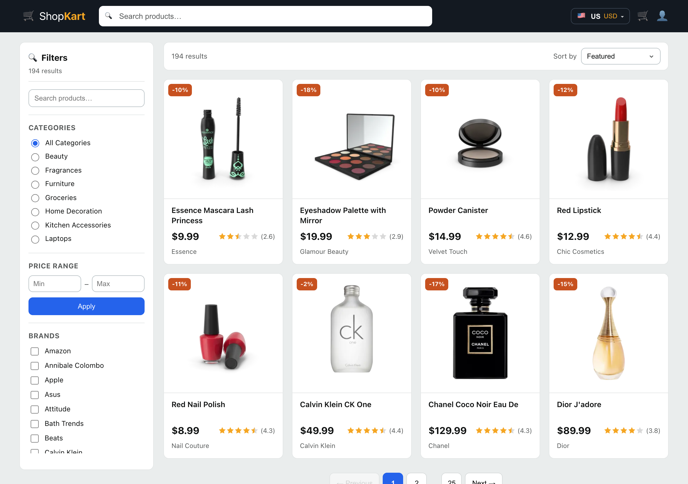
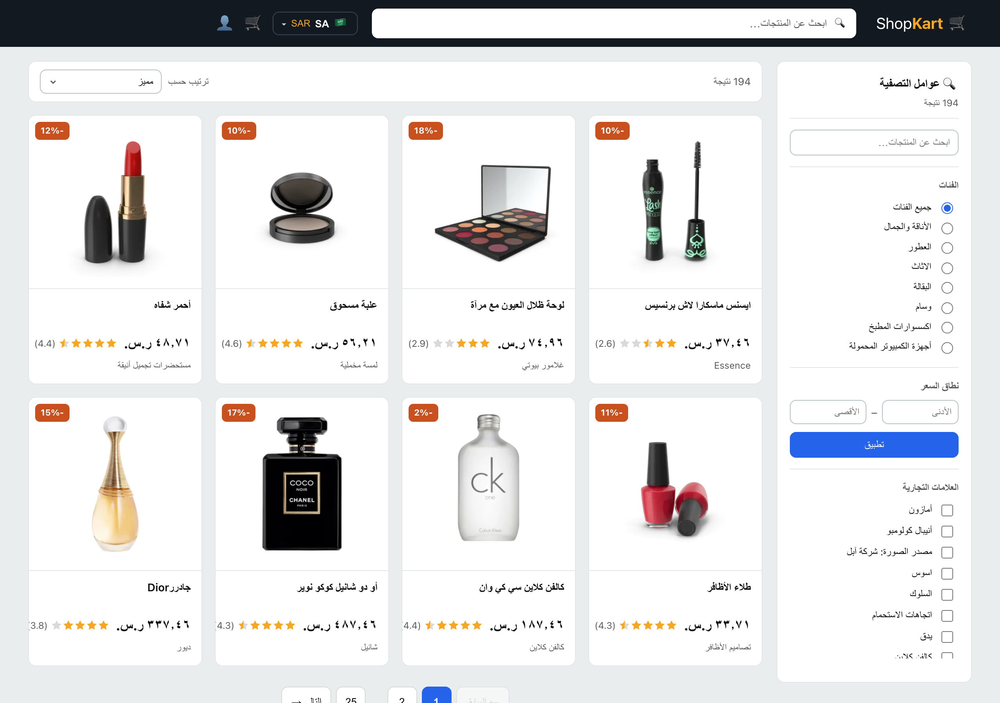
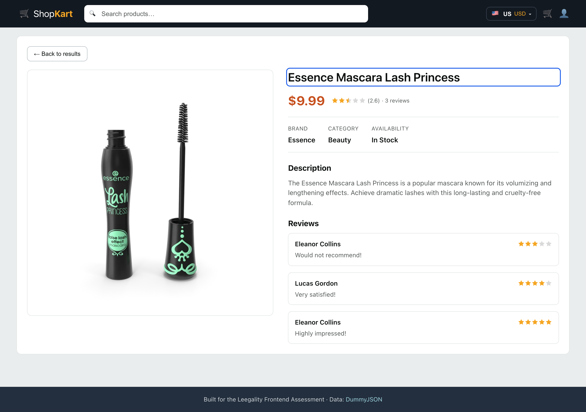
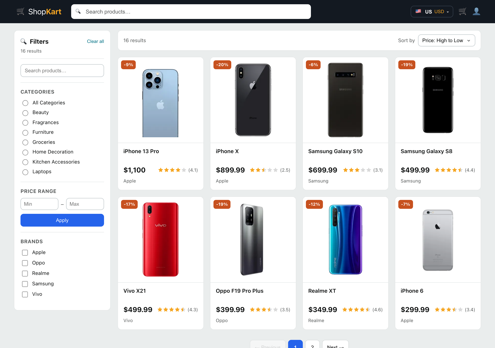

# 🛒 ShopKart — Product Listing & Detail App

[](https://github.com/GAJENDRA-KUMAR325/leegality-product-app/actions/workflows/ci.yml)


> Amazon-style e-commerce catalogue built on the [DummyJSON API](https://dummyjson.com/docs/products) for the **Leegality Frontend Engineer Assessment**.
>
> **Repo:** https://github.com/GAJENDRA-KUMAR325/leegality-product-app · **Live demo:** https://gajendra-kumar325.github.io/leegality-product-app/

A production-minded React app demonstrating API integration, reusable components, state management, combined filtering, routing — and going further with a full **internationalization layer** (language + currency + RTL + machine-translated product content), **URL-synced filters**, **tests**, and **accessibility**.



---

## ✨ Highlights

| | |
| --- | --- |
| 🔎 **Combined filtering** | Category · price range · multi-brand · search — all compose, update instantly, and reset pagination |
| 🔗 **URL-synced state** | Filters/sort/page live in the query string → **shareable, bookmarkable, refresh-proof** |
| ↕️ **Sorting** | Featured · price ↑/↓ · top-rated · name |
| 🌍 **Internationalization** | 10 countries / 9 languages, **currency conversion**, **RTL**, and **machine-translated product content** |
| ♿ **Accessibility** | Skip link, focus management, keyboard nav, ARIA, reduced-motion, semantic landmarks |
| 🧪 **Tested** | Vitest + React Testing Library — unit + integration (18 tests) |
| ⏳ **Robust states** | Loading skeletons, error + retry, empty state on every async surface — plus a top-level **error boundary** |
| 🚀 **CI + coverage** | GitHub Actions runs build + tests with a **coverage gate**; Vercel/Netlify SPA config included |

### 🌍 The standout: real internationalization

Pick a country and the **entire app** adapts — UI language, currency (converted from USD + locale-aware formatting), text **direction**, and even the **product titles/descriptions** (machine-translated at runtime). Here's the same catalogue in Arabic — note the fully **mirrored RTL layout**, Arabic product names, and SAR pricing in Arabic numerals:



<table>
<tr>
<td width="50%"></td>
<td width="50%"></td>
</tr>
<tr>
<td align="center"><em>Detail page — gallery, reviews, brand/category</em></td>
<td align="center"><em>Category filter + price-high-to-low sort (URL-driven)</em></td>
</tr>
</table>

---

## 🚀 Setup

**Prerequisites:** Node.js ≥ 18

```bash
npm install
npm run dev        # → http://localhost:5173

npm run build      # production build
npm run preview    # serve the build locally
npm test           # watch mode
npm run test:run   # single run (used by CI)
```

No API keys or env vars required — DummyJSON and the translation API are public.

---

## 🧱 Tech Stack

| Concern    | Choice |
| ---------- | ------ |
| Framework  | React 18 (functional components + hooks) |
| Build      | Vite 5 |
| Routing    | React Router v6 |
| State      | Context API + the URL (query string) |
| i18n       | Custom `LocaleContext` — **no i18n library** |
| Styling    | Hand-written CSS (no UI library) |
| Testing    | Vitest + React Testing Library |

> Per the brief, no heavy UI library is used.

---

## 🗂 Project Structure

```
src/
├── api/
│   ├── products.js        # DummyJSON network layer
│   └── translate.js       # runtime translation (cache + dedupe + fail-soft)
├── components/            # Navbar, Filters, ProductCard, Pagination, StarRating,
│   │                      # LocaleSwitcher, TranslatedText, States, ErrorBoundary…
│   └── *.test.jsx
├── context/
│   ├── FilterContext.jsx  # filters/sort/page ↔ URL query string
│   └── LocaleContext.jsx  # language + currency + direction
├── hooks/                 # useProducts, useCategories, useDebounce, useTranslated
├── i18n/                  # locales.js (countries) + translations.js (dictionaries)
├── pages/
│   ├── ProductListPage.jsx
│   ├── ProductDetailPage.jsx
│   └── ProductListPage.test.jsx
├── utils/                 # filtering.js (pure) + currency.js
└── test/setup.js
```

---

## 🏛 Architectural Decisions

1. **One API module.** All `fetch` lives in `api/` behind a small surface, so the data source/caching can change in one place.
2. **Filters live in the URL.** `FilterContext` reads/writes the query string via `useSearchParams`, making views shareable and satisfying *"filters remain applied when navigating back"* via native history.
3. **Fetch the scope once, filter/sort/paginate on the client.** The catalogue is small (~194), so category selection hits the API (`limit=0`) and everything else is in-memory — correct combined filtering and instant feedback. (Scaling path: push to server `limit`/`skip`.)
4. **Pure, tested logic.** `utils/filtering.js` is side-effect-free (`applyFilters`, `sortProducts`, `extractBrands`, `paginate`) and unit-tested.
5. **Locale as its own context, no library.** `t(key)` + `formatPrice(usd)` + `dir`; adding a country = one row, a language = one block.
6. **Runtime translation with a cache.** `api/translate.js` (MyMemory, no key) caches in memory + localStorage, de-dupes in-flight requests, and fails soft to English. A synchronous `isCached` check lets the UI show a loader and reveal only once content is ready — no English-first flash.

---

## ♿ Accessibility

Skip-to-content link · single `<main>` landmark · focus moved to the product heading on navigation · visible keyboard focus rings (`:focus-visible`) · ARIA labels on controls and an `aria-live` result count · `prefers-reduced-motion` respected · semantic, keyboard-operable filters and pagination.

---

## 🧪 Testing & coverage

```bash
npm run test:run        # run the suite once (31 tests)
npm run test:coverage   # run with a V8 coverage report (HTML in coverage/)
```

**31 tests across unit, component and integration levels:**
- **Unit** — `utils/filtering.test.js` (price/brand/search filtering, AND-composition, sorting with a no-mutation guarantee, pagination) and `utils/currency.test.js` (conversion + locale-aware formatting).
- **Component** — `StarRating.test.jsx` (rendering + accessible labels) and `Pagination.test.jsx` (disabled states, page selection, `aria-current`, ellipsis collapsing).
- **Integration** — `ProductListPage.test.jsx` mounts the page with a mocked API and asserts the grid renders, that **selecting a brand filters the grid**, and that **sorting reorders** it.

Coverage is **gated in CI** (statements/branches/lines ≥ 70%, functions ≥ 50% — see `vite.config.js`); the report uploads as a build artifact on every run. The core logic (`filtering`, `currency`, contexts) sits at 95–100%.

---

## 📌 Assumptions

- **Category** is single-select (DummyJSON serves one category per endpoint); brands are multi-select.
- **Brands** are derived from the fetched scope; only ~half of products have one, and a selected brand excludes brand-less products. Translated brand text is display-only — the English brand stays the filter key.
- **Price** commits on Apply/Enter (not per keystroke); category/brand/search/sort apply instantly.
- **Page size** is 8 (matches the 2×4 mockup).
- **i18n scope:** UI + prices + product content are localized. Machine translation is best-effort (brands may transliterate); a language switch shows a loader and reveals once everything's ready, then caches. FX rates are a static table (see decision #6) — swap for a live feed in production.

---

## 🔭 With More Time

- Sync filters to the URL ✅ *(done)* → next: server-side filtering/pagination for large catalogues.
- React Query/SWR for caching, retry/back-off and request dedupe.
- Live FX rates + a keyed translation provider (DeepL/Google) or server-side pre-translation.
- TypeScript for end-to-end typed API models.
- More tests (detail page, locale switching) + Playwright e2e; image `srcset`.

---

## 📡 API Endpoints

| Purpose         | Endpoint |
| --------------- | -------- |
| Catalogue/scope | `GET /products?limit=0` |
| Category scope  | `GET /products/category/{slug}?limit=0` |
| Categories      | `GET /products/categories` |
| Product detail  | `GET /products/{id}` |
| Translation     | `GET https://api.mymemory.translated.net/get` (free, no key) |

---

## 🤖 AI tooling

This project was built with AI assistance (Claude Code / Claude Opus 4.8), used to scaffold, implement, and iterate — with all architecture, product decisions, and review done by me. Full transparency on the tool, the prompts, and the token/cost breakdown is in **[AI_USAGE.md](AI_USAGE.md)**.

---

Built with care for the Leegality Frontend Assessment.
*(Regenerate screenshots: `npm run dev`, then `npm i -D playwright && npx playwright install chromium && node scripts/screenshot.mjs`.)*
